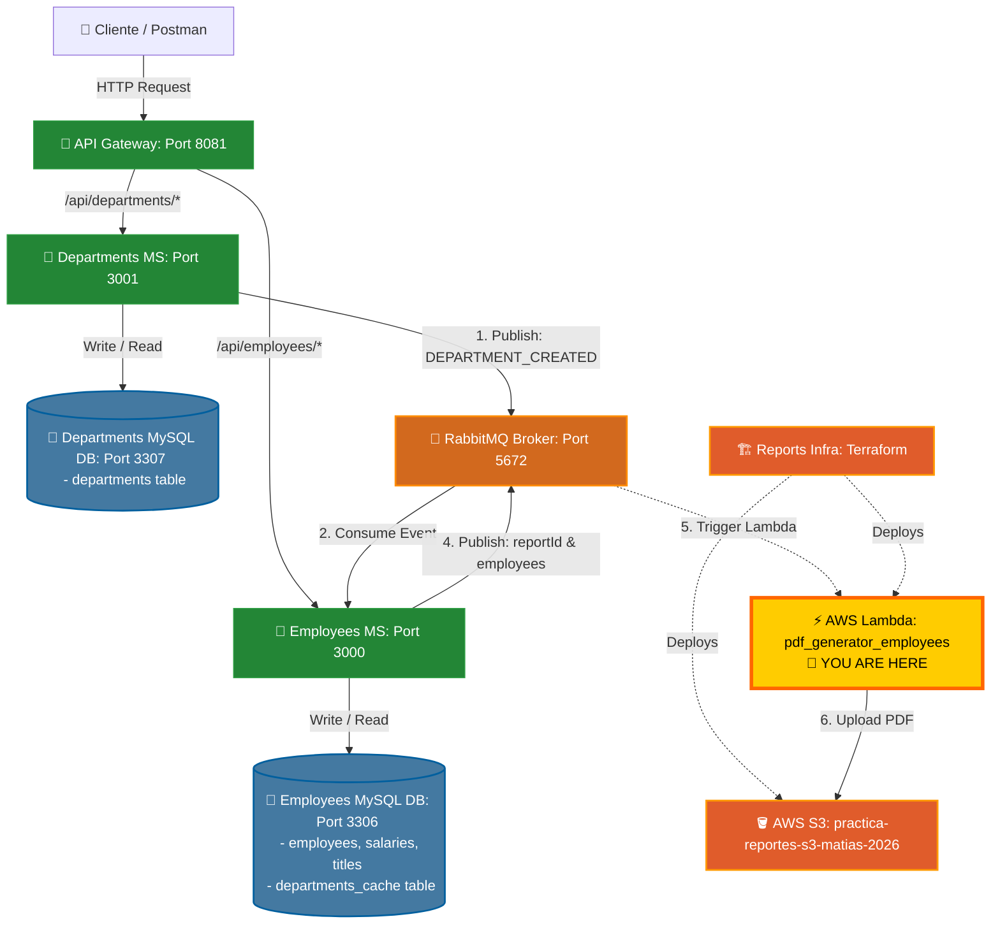

# 👥 PDF Generator Microservice (pdf_generator_employees)

<p align="center">
  
  
  
</p>

---

## 📝 Description

This component is a serverless microservice designed to run as an **AWS Lambda function** (`generador-reportes-pdf`). Its core responsibility is to generate formatted PDF employee reports dynamically and store them securely in **Amazon S3** for public retrieval.

It is built on **Node.js**, using **PDFKit** for in-memory stream-based PDF generation, and the native **AWS SDK for JavaScript v3** to upload files.

---

## 🔗 Connected Repositories

This project belongs to a multi-repository microservices ecosystem. Ensure you have all repositories cloned for full integration:

*   **API Gateway:** [employees_api_gateway](https://github.com/MNATorres/employees_api_gateway.git)
*   **Departments Microservice:** [departments_ms](https://github.com/MNATorres/departments_ms.git)
*   **Employees Microservice:** [employees_ms](https://github.com/MNATorres/employees_ms.git)
*   **PDF Generator (AWS Lambda - This repo):** [pdf_generator_employees](https://github.com/MNATorres/pdf_generator_employees.git)
*   **Reports Infrastructure (Terraform):** [reports_infra_ms](https://github.com/MNATorres/reports_infra_ms.git)

---

## 🏗️ System Architecture & Message Flow

The architecture consists of several microservices cooperating over synchronous proxy requests, asynchronous RabbitMQ event streaming, and serverless PDF generation in the cloud.



---

## ✨ Features

*   **Serverless Execution:** Completely stateless, runs on demand on AWS Lambda.
*   **In-Memory PDF Design:** Generates reports with professional aesthetics (headers, dividers, customized styles) without using temporary local files.
*   **Automated S3 Upload:** Automatically uploads the resulting `.pdf` document to Amazon S3 with proper content-type headers so it can be streamed directly in browsers.
*   **Dual Payload Parser:** Can parse incoming payloads directly from direct AWS Lambda invocations or via proxy events (e.g. from API Gateway / SQS / RabbitMQ queues).

---

## 🚀 Execution & Packaging

### Event Structure (Payload)

The handler expects a JSON payload containing the report metadata and employee array:

```json
{
  "reportId": "sales-report-2026",
  "employees": [
    {
      "id": 1,
      "name": "Matias Torres",
      "role": "Cloud Architect & Dev"
    }
  ]
}
```

### Deployment

This code is packaged into a `.zip` file and deployed to AWS Lambda via Terraform from the sister project [reports_infra_ms](https://github.com/MNATorres/reports_infra_ms.git).

Ensure you run `npm install` inside this folder before deploying through Terraform, so that the required dependencies (`pdfkit` and `@aws-sdk/client-s3`) are packed together with the handler code.
